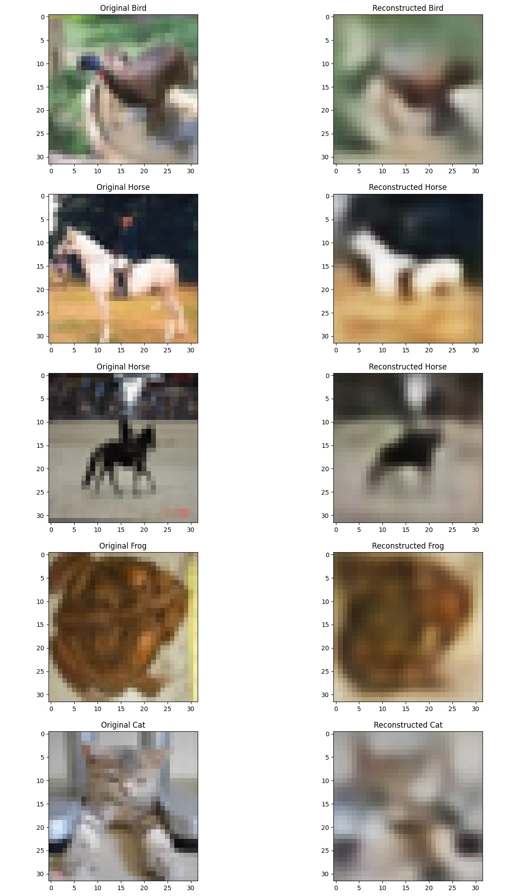
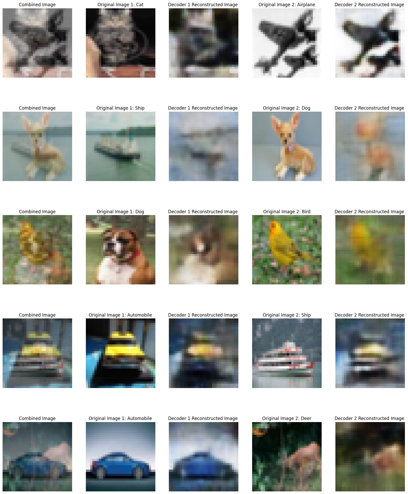
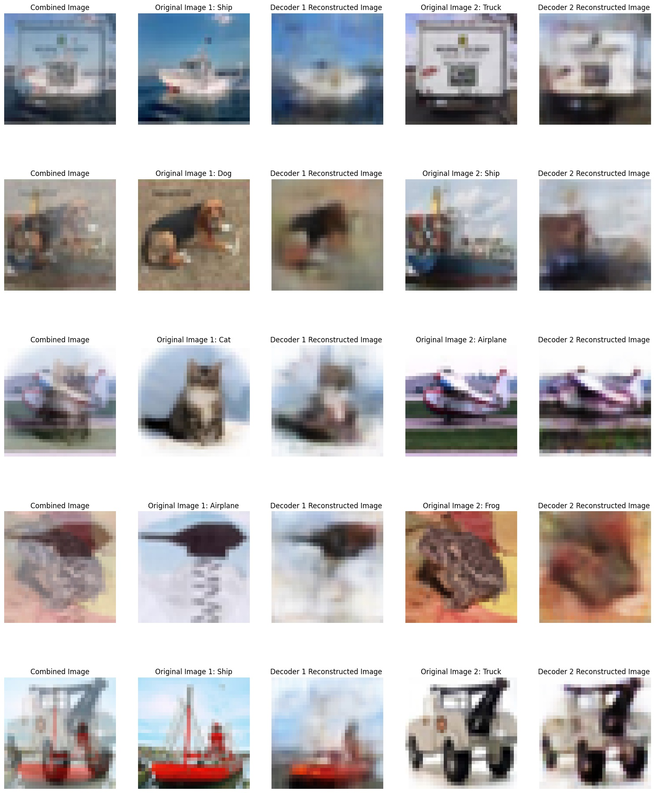

# PyTorch Autoencoder for CIFAR-10 Image Reconstruction

This repository contains a Python project that implements an autoencoder using PyTorch to reconstruct images from the CIFAR-10 dataset. The autoencoder is designed to learn encodings of images, enabling it to reconstruct individual images. Given a combination of two images, the model can reconstruct each image separately.

## Table of Contents

- [Features](#features)
- [Requirements](#requirements)
- [Dataset](#dataset)
- [Usage](#usage)
- [Results](#results)
- [License](#license)


## Features

Autoencoders are neural networks that learn to compress and then reconstruct data, effectively capturing the most important features of the input data. In this project, an autoencoder is trained on the CIFAR-10 dataset, a well-known collection of 32x32 images across 10 different classes.

The autoencoder can:

- Reconstruct individual images from the dataset.
- Reconstruct each image separately when given a combination of two images.

This implementation is built using PyTorch and is contained within a single Jupyter Notebook.
A separate autoencoder with the aim of simply reconstructing a single image is also provided as a bonus at the end of the file.


## Requirements

- Python 3.7+
- PyTorch 1.7+
- torchvision
- matplotlib


## Dataset

The dataset used for this project is CIFAR-10, which is not included in this repository. CIFAR-10 consists of 60,000 32x32 color images in 10 classes, with 6,000 images per class. You can download the dataset using torchvision's built-in utility.

```python
import torchvision.datasets as datasets

train_data = datasets.CIFAR10(root='./data', train=True, download=True)
test_data = datasets.CIFAR10(root='./data', train=False, download=True)
```


### Usage

Open the Jupyter Notebook `Autoencoder-Image-Reconstruction.ipynb` and run the cells sequentially. The notebook contains code for:

- Loading and preprocessing the CIFAR-10 dataset.
- Defining the autoencoder model.
- Training and testing the autoencoder.
- Visualizing the reconstruction results.


## Results

Below are examples of images reconstructed by the autoencoder:

### Single Image Sample


### Combined Image Sample 1


### Combined Image Sample 2



## License

This project is licensed under the Apache 2.0 License - see the [LICENSE](LICENSE) file for details.
